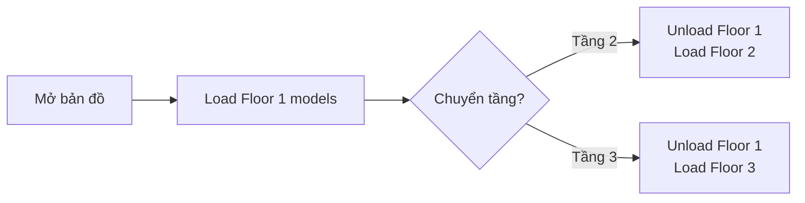
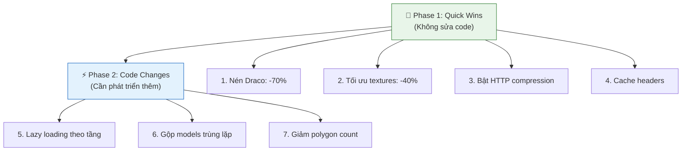

# 📊 Phân Tích & Đề Xuất Tối Ưu 3D Models Cho Bản Đồ Sân Bay

## Hiện Trạng

| Chỉ số | Giá trị |
|--------|---------|
| **Tổng file GLB** | 153 file |
| **Tổng dung lượng** | ~283 MB |
| **Trung bình/file** | ~1.9 MB |
| **Định dạng** | `.glb` (glTF Binary) |
| **Cách phục vụ** | Express static (`/Model3D/`) |
| **Cách load** | `mapView.Models.add(coord, url)` - Mappedin SDK |
| **Nén hiện tại** | ❌ Không có (Draco/Meshopt chưa được sử dụng) |
| **Lazy loading** | ❌ Không có |
| **LOD (Level of Detail)** | ❌ Không có |

### Phân bổ loại Models

```
🚀 Airlines (gates)      : ~50+ file (Gate 1-25 + phiên bản "thả trần")
🌳 Cây cảnh              : ~10 file (cau, cọ, dương xỉ, lưỡi hổ...)
🏗️ Thiết bị sân bay      : ATM, cổng từ, cửa kính, xe đẩy, máy soi...
✈️ Hãng hàng không       : AirFrance, Vietnam Airlines, Vietjet, United...
🏢 Nội thất              : Ghế chờ, quầy check-in, màn hình TV...
```

---

## ⚠️ Vấn Đề Cốt Lõi

Khi **tất cả** 150+ models được load cùng lúc, trình duyệt phải:

1. **Tải xuống ~283MB** qua mạng (nếu không cache)
2. **Giải mã 153 file GLB** đồng thời → tốn CPU + RAM
3. **Render tất cả** trong WebGL → GPU bị quá tải
4. **Lưu trữ textures/geometry** trong VRAM → dễ bị crash trên thiết bị yếu

### ❓ Nếu chỉ nén Draco thì 85MB vẫn nặng?

Đúng. Chỉ dùng Draco riêng lẻ thì chưa đủ. Nhưng **kết hợp nhiều phương án cùng lúc** sẽ giảm rất mạnh:

| Kết hợp | Tổng ước tính |
|---------|---------------|
| Chỉ Draco | ~85 MB |
| Draco + WebP textures | ~40-50 MB |
| Draco + WebP + Simplify polygon 50% | **~20-30 MB** |
| + HTTP Brotli compression | **~15-20 MB** truyền qua mạng |

Với `gltf-transform`, có thể chạy tất cả cùng 1 lệnh:
```bash
gltf-transform optimize input.glb output.glb --compress draco --texture-compress webp --simplify --simplify-ratio 0.5
```

> [!IMPORTANT]
> Kết hợp cả 3: **283MB → ~20-30MB** (giảm ~90%) — hoàn toàn khả thi.

### ❓ Models trùng lặp (thang máy, thang cuốn) đặt nhiều vị trí → CÓ phình bộ nhớ không?

**CÓ — đây là vấn đề lớn nhất.** Mỗi lần gọi `mapView.Models.add(coord, url)`, SDK tạo **bản sao riêng biệt** trong GPU:

```
Đặt thang máy ở 10 vị trí → 10 bản sao geometry + textures trong VRAM
= 10 × 6MB = 60MB VRAM CHỈ CHO THANG MÁY
```

| Loại | Network (download) | GPU/RAM |
|------|-------------------|--------|
| Cùng URL, đặt N lần | ✅ Download 1 lần (browser cache) | ❌ **N bản sao** trong VRAM |

**Ví dụ thực tế:**

| Model | Kích thước | Số lần đặt | RAM thực tế |
|-------|-----------|------------|-------------|
| Thang máy | 6 MB | 10 vị trí | ~60 MB VRAM |
| Thang cuốn | 5 MB | 8 vị trí | ~40 MB VRAM |
| Ghế chờ | 4 MB | 20 vị trí | ~80 MB VRAM |
| **Tổng** | | | **~180 MB chỉ cho 3 loại** |

**Giải pháp: GPU Instancing** — load geometry 1 lần, "nhân bản" ở nhiều vị trí gần như không tốn bộ nhớ:
```
1 file thang máy (6MB) × 10 vị trí = ~6.01 MB (thay vì 60MB)
```

---

## 🎯 CÁC PHƯƠNG ÁN TỐI ƯU (Xếp theo độ hiệu quả)

### Phương Án 1: Nén GLB bằng Draco / glTF-Transform ⭐⭐⭐⭐⭐

> **Hiệu quả: Giảm 60-80% kích thước file**  
> **Độ khó: Thấp**  
> **Ảnh hưởng chất lượng: Không đáng kể**

Sử dụng tool [gltf-transform](https://gltf-transform.dev/) hoặc [gltf-pipeline](https://github.com/CesiumGS/gltf-pipeline) để nén geometry bằng **Draco compression**.

```bash
# Cài đặt
npm install -g @gltf-transform/cli

# Nén 1 file
gltf-transform draco input.glb output.glb

# Nén tất cả (script batch)
for file in Model3D/*.glb; do
  gltf-transform draco "$file" "$file.optimized.glb"
done
```

| Trước | Sau (Draco) | Giảm |
|-------|------------|------|
| 6 MB | ~1.2-1.8 MB | **70-80%** |
| 283 MB tổng | ~57-85 MB | **70%** |

> [!IMPORTANT]
> Mappedin SDK sử dụng Three.js bên dưới, Three.js **hỗ trợ sẵn** Draco decoder. Chỉ cần nén file, không cần thay đổi code load.

---

### Phương Án 2: Tối Ưu Textures ⭐⭐⭐⭐

> **Hiệu quả: Giảm 30-60% kích thước**  
> **Độ khó: Thấp**  
> **Ảnh hưởng chất lượng: Rất nhỏ**

Nhiều model 3D chứa textures PNG không nén. Chuyển sang **WebP** hoặc **KTX2 (GPU texture)** sẽ giảm đáng kể.

```bash
# Nén textures trong GLB sang WebP
gltf-transform webp input.glb output.glb --quality 80

# Hoặc KTX2 (tốt nhất cho GPU, nhưng cần kiểm tra SDK hỗ trợ)
gltf-transform ktx2 input.glb output.glb
```

---

### Phương Án 3: Giảm Polygon Count (Decimation) ⭐⭐⭐⭐

> **Hiệu quả: Giảm 40-70% geometry**  
> **Độ khó: Trung bình**  
> **Ảnh hưởng chất lượng: Có thể nhận thấy nếu giảm quá mạnh**

Các model 3D thường có polygon count quá cao cho nhu cầu hiển thị trên bản đồ (nhìn từ trên xuống, khoảng cách xa).

```bash
# Giảm 50% polygon
gltf-transform simplify input.glb output.glb --ratio 0.5

# Giảm mạnh hơn cho models nhìn từ xa (70%)
gltf-transform simplify input.glb output.glb --ratio 0.3
```

> [!TIP]
> Với bản đồ nhìn từ trên (bird's eye view), có thể giảm đến **70% polygon** mà người dùng hầu như không nhận ra sự khác biệt.

---

### Phương Án 4: Tối Ưu & Loại Bỏ Dữ Liệu Thừa ⭐⭐⭐

> **Hiệu quả: Giảm 10-30%**  
> **Độ khó: Thấp**

```bash
# Loại bỏ dữ liệu không cần thiết (normals thừa, metadata...)
gltf-transform optimize input.glb output.glb

# Gộp meshes, loại bỏ nodes rỗng
gltf-transform flatten input.glb output.glb
gltf-transform join input.glb output.glb

# Loại bỏ dữ liệu animation nếu không cần
gltf-transform prune input.glb output.glb
```

---

### Phương Án 5: Lazy Loading theo Floor / Viewport ⭐⭐⭐⭐⭐

> **Hiệu quả: Giảm 60-80% lượng load ban đầu**  
> **Độ khó: Trung bình-Cao (cần sửa code)**

Thay vì load **tất cả models** khi mở bản đồ, chỉ load models thuộc **tầng đang xem**.



**Logic cần implement:**

```typescript
// Khi chuyển tầng, chỉ load models cho tầng đó
mapView.on('floor-change', async (event) => {
  const floorId = event.floor.id;
  
  // Unload models tầng cũ (giải phóng bộ nhớ)
  unloadModelsForFloor(previousFloorId);
  
  // Load models tầng mới
  await loadModelsForFloor(floorId);
});
```

---

### Phương Án 6: Gộp Models Trùng Lặp (Instancing) ⭐⭐⭐

> **Hiệu quả: Giảm tải network đáng kể nếu nhiều models giống nhau**  
> **Độ khó: Trung bình**

Nhiều **Gate** có cùng model (Gate 1-25 + phiên bản "thả trần" = **50 file riêng biệt**). Nếu các file này dùng chung geometry, có thể:

- Load **1 file GLB duy nhất** cho gate
- Dùng **GPU instancing** để hiển thị ở nhiều vị trí khác nhau
- Giảm từ 50 file → 2 file (1 kiểu gate + 1 kiểu "thả trần")

---

### Phương Án 7: Bật HTTP Compression (Gzip/Brotli) ⭐⭐⭐

> **Hiệu quả: Giảm 20-40% kích thước truyền tải**  
> **Độ khó: Rất thấp (1 dòng code)**

```typescript
// backend/server.ts - Thêm compression middleware
import compression from 'compression';
app.use(compression()); // Brotli/Gzip tự động cho mọi response
```

```bash
npm install compression @types/compression
```

> [!NOTE]
> Hiện tại Express serve static **không có compression**. Bật lên sẽ giảm bandwidth ngay lập tức.

---

### Phương Án 8: Cache Thông Minh ⭐⭐⭐

> **Hiệu quả: Chỉ download lần đầu, sau đó gần như instant**  
> **Độ khó: Thấp**

```typescript
// backend/server.ts - Cache headers cho Model3D
app.use('/Model3D', express.static(path.join(ROOT_DIR, 'Model3D'), {
  maxAge: '30d',        // Cache 30 ngày
  immutable: true,      // File không thay đổi
  etag: true,           // ETag validation
  lastModified: true
}));
```

---

## 🏆 LỘ TRÌNH KHUYẾN NGHỊ



### Phase 1: Quick Wins (Thực hiện ngay, không sửa code logic)

| Bước | Phương án | Thời gian | Kết quả dự kiến |
|------|-----------|-----------|-----------------|
| 1 | Nén Draco + Tối ưu textures | 1-2 giờ | **283MB → ~60-85MB** |
| 2 | Bật HTTP compression (Brotli) | 10 phút | Giảm thêm ~30% bandwidth |
| 3 | Thêm cache headers | 5 phút | Load lần sau gần instant |

### Phase 2: Code Changes (Nếu Phase 1 chưa đủ)

| Bước | Phương án | Thời gian | Kết quả dự kiến |
|------|-----------|-----------|-----------------|
| 4 | Lazy loading theo tầng | 4-8 giờ | Load ban đầu giảm 60-80% |
| 5 | Gộp Gate models (Instancing) | 2-4 giờ | 50 file → 2 file |
| 6 | Giảm polygon count | 1-2 giờ | Giảm thêm 40-50% geometry |

---

## 📋 Script Nén Batch (Sẵn sàng sử dụng)

Tôi có thể tạo script PowerShell/Node.js để **tự động nén tất cả 153 file GLB** bằng Draco + WebP textures. Script sẽ:

1. Backup file gốc vào thư mục `Model3D_backup/`
2. Nén từng file bằng `gltf-transform draco + webp + simplify`
3. Tạo báo cáo so sánh kích thước trước/sau
4. Kiểm tra file nén có hợp lệ không

> [!CAUTION]
> Trước khi nén, cần **kiểm tra Mappedin SDK có hỗ trợ Draco decoder** hay không. Nếu không, phải sử dụng phương án nén textures + simplify (không dùng Draco) thay thế.
